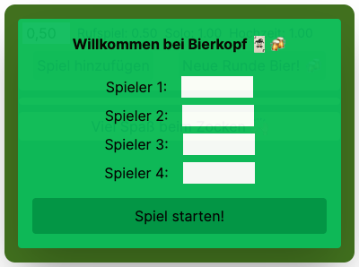
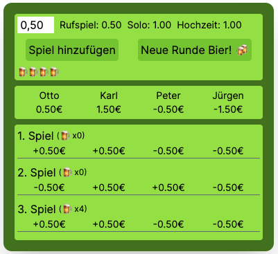

    
    

# Bierkopf Tracker 🃏🍻

## For the English version of this documentation, please see [README-EN.md](README-EN.md) 🇺🇸 🇬🇧

Our tracker for the German card game "Schafkopf". Here you can not only keep track of games and bets, but also count the beer consumption 😜🍻.

## Features

- **Start a New Game**: Simply enter the names of the players and start a new round.
- **Game Control**: Add games, change bet sizes, and keep track of the beer rounds.
- **Player Display**: Here you can see the names of the players and their current balances.
- **Game History**: This section lists all details of past games, including winner and loser teams, bet sizes, and how much beer was consumed.
- **Save/Load API**: Save/load your game state (RAM in the Go backend server). A simple volatile storage option (no database) was deliberately chosen as this is my first full-stack project, and I want to focus on frontend specialization first.

## Future Features and Ideas

- **Additional Game Modes**: Solo games, weddings, Ramsch
- **More Calculation Factors**: Laufende, Schneider, Schwarz, Doppeln
- **Bavarian Background Image**: Gives the game an authentic Bavarian flair with a matching background image.
- **Effects Based on Beer Rounds**: These make the gaming experience more lively, based on the number of beer rounds. For example, the background could become very blurry and wobbly after the 5th beer round.
- **Small Söder Easter Egg**: Markus Söder will be integrated. After the 5th beer, he hides in a corner, and when you mouse over him, he jumps out with a random saying.
- **Database**: Save/load game state using a database in the backend server.

## Usage

1. Enter the names of the players and start a new game.
2. Alternatively, load an old game state (the beer counter consciously resets to 0).
3. Add games, change bet sizes as needed, and keep track of the beer consumption.
4. Save the game state if you want to continue playing at a later time.

## Known Issues

- Players must have different names, otherwise the games will not be calculated correctly.
  - This issue is easily fixable and will be addressed in a future version or player naming will be restricted.
- Saving/loading only works in the local environment (it's best to clone the repository for this purpose).
  - I encountered difficulties deploying the Go code on the Vercel platform.

## Technologies

- React.js
- Tailwind CSS
- Go

## Author

[ScaxCodes](https://github.com/ScaxCodes)

## License

This project is licensed under the [MIT License](https://opensource.org/licenses/MIT).
