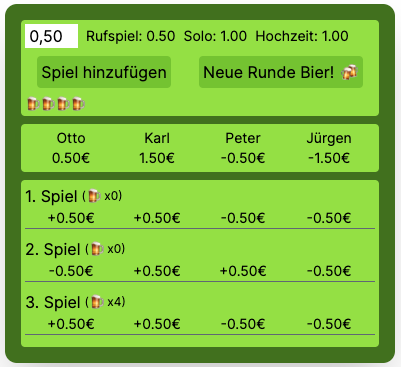

    
    

# Bierkopf Tracker 🃏🍻

## For the English version of this documentation, please see [README-EN.md](README-EN.md) 🇺🇸 🇬🇧

Ein Tracker für das deutsche Kartenspiel "Schafkopf". Hier kannst du nicht nur Spiele und Einsätze festhalten, sondern auch den Bierkonsum mitzählen 😜🍻.

## Funktionen

- **Neues Spiel starten**: Gib einfach die Namen der Spieler ein und starte eine neue Runde.
- **Spielsteuerung**: Füge Spiele hinzu, ändere die Einsatzgröße und behalte den Überblick über die Bierrunden.
- **Spieleranzeige**: Hier siehst du die Namen der Spieler und ihre aktuellen Kontostände.
- **Spielhistorie**: Hier werden alle Details der vergangenen Spiele aufgelistet, einschließlich Gewinner- und Verliererteams, Einsatzgrößen und wie viel Bier getrunken wurde.
- **Speichern/Laden API**: Speichere/Lade deinen Spielstand (RAM im Go-Backend-Server). Es wurde bewusst die einfache Variante eines flüchtigen Speichers (und keine Datenbank) gewählt, da dies mein erstes Full-Stack-Projekt ist, und ich mich zunächst weiter auf die Frontend Spezialisierung konzentrieren möchte.

## Live-Demo

- https://bierkopf.vercel.app/

## Nutzung

1. Gib die Namen der Spieler ein und starte ein neues Spiel.
2. Lade Alternativ einen alten Spielstand (der Bierzähler setzt sich dabei bewusst auf 0 zurück).
3. Füge Spiele hinzu, ändere bei Bedarf den Einsatz und halte den Bierkonsum im Blick.
4. Speichere den Spielstand, wenn du zu einem späteren Zeitpunkt weiterspielen möchtest.

## Bekannte Fehler

- Die Spieler müssen unterschiedliche Namen haben, sonst werden die Spiele nicht korrekt berechnet
  - Dieser Fehler lässt sich einfach beheben und wird in einer zukünftigen Version gefixt, oder die Spielerbenennung eingeschränkt
- Speichern/Laden funktioniert nur in der lokalen Umgebung (am besten klonst du dafür das Repository)
  - Ich hatte hier Schwierigkeiten mit dem deployment des go codes auf der Plattform Vercel

## Zukünftige Funktionen und Ideen

- **Weitere Spielmodi**: Solo Spiele, Hochzeiten, Ramsch
- **Weitere Rechenfaktoren**: Laufende, Schneider, Schwarz, Doppeln
- **Bayerisches Hintergrundbild**: Verleiht dem Spiel einen authentischen bayerischen Flair mit einem passenden Hintergrundbild.
- **Effekte basierend auf Bierrunden**: Diese machen das Spielerlebnis lebendiger, basierend auf der Anzahl der Bierrunden. Zum Beispiel könnte der Hintergrund nach der 5. Bierrunde sehr verschwommen sein und stark wackeln.
- **Kleines Söder Easteregg**: Markus Söder wird integriert. Nach dem 5. Bier versteckt er sich in einer Ecke, und wenn man mit der Maus über ihn fährt, springt er mit einem zufälligen Spruch hervor.
- **Datenbank**: Speichere/Lade den Spielstand mittels Datenbank im Backend-Server.

## Technologien

- React.js
- Tailwind CSS
- Go

## Autor

[ScaxCodes](https://github.com/ScaxCodes)

## Lizenz

Dieses Projekt ist unter der [MIT-Lizenz](https://opensource.org/licenses/MIT) lizenziert.
